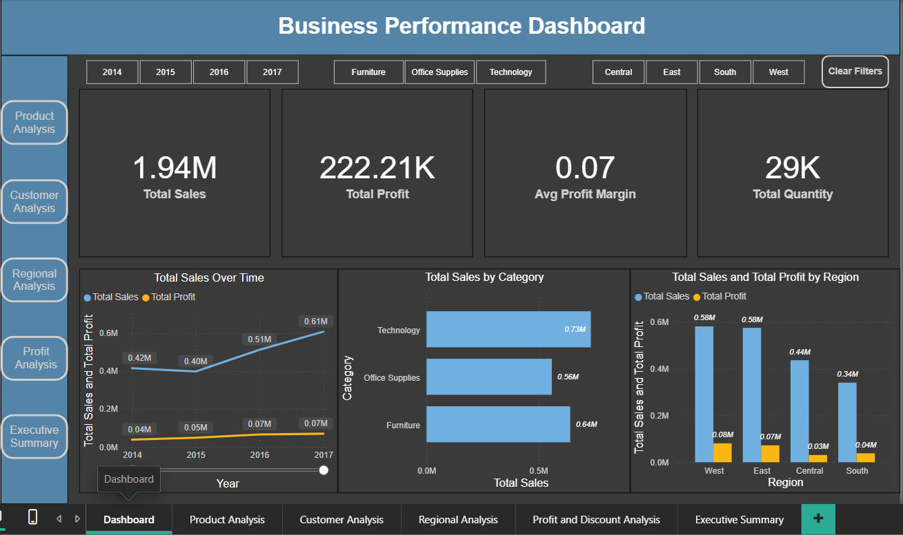
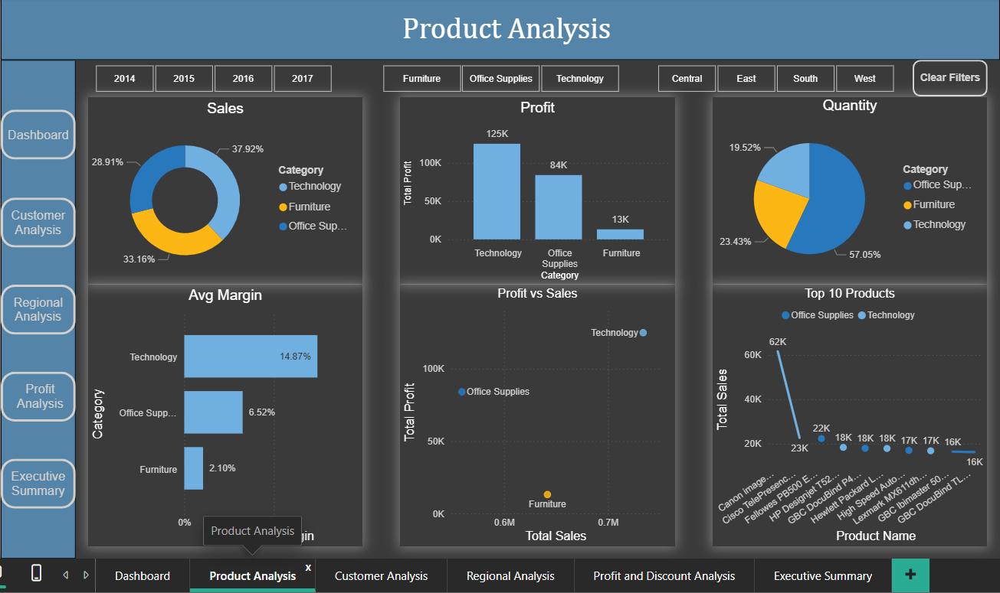
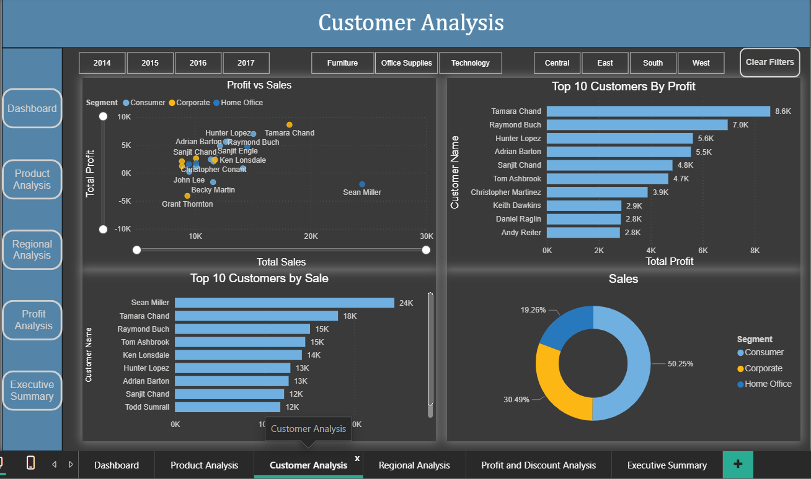
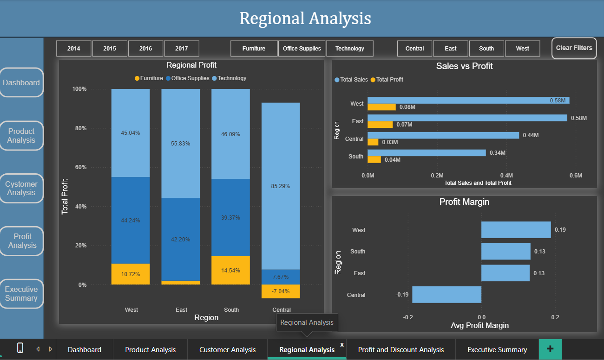
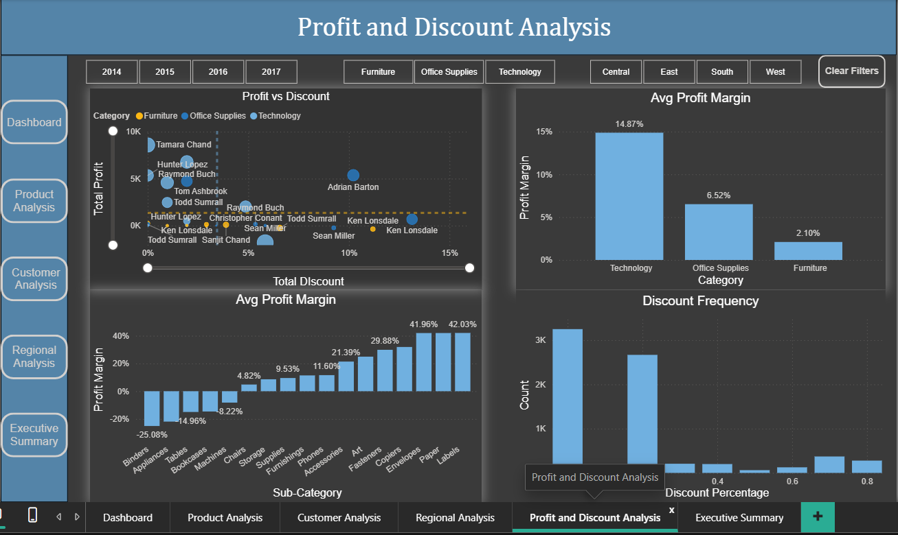
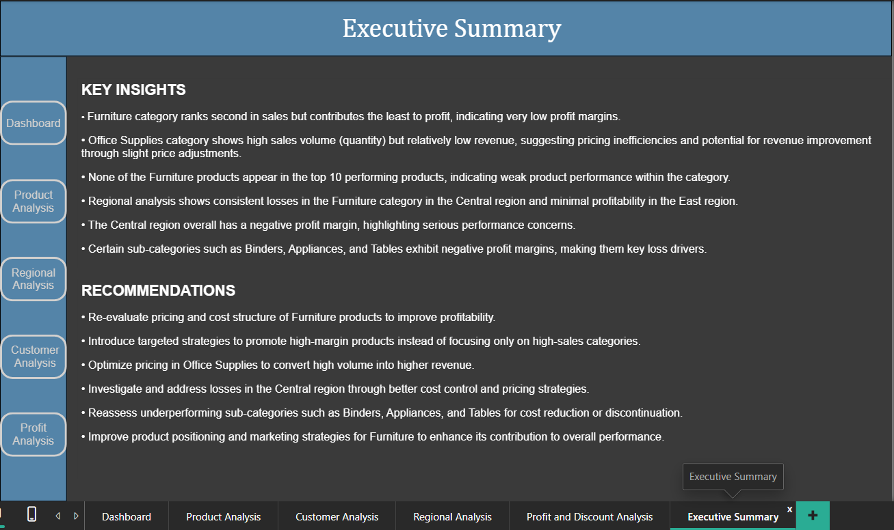

# Power BI Sales & Profit Analysis Dashboard

## Overview
This project presents an interactive Power BI dashboard analyzing sales, profit, customer behavior, and regional performance.

---

##  Features
- Multi-page dashboard (Overview, Product, Customer, Regional, Profit & Discount)
- Interactive slicers and navigation
- DAX-based calculations (Profit Margin, YoY Growth)
- Advanced visuals including scatter plots and Top-N analysis

---

## Key Insights
- Furniture category has high sales but very low profitability
- High discounts negatively impact profit
- Central region has negative profit margin
- Few customers contribute majority of revenue
- Certain sub-categories like Binders, Appliances, and Tables are loss-making

---

## Tools Used
- Power BI
- DAX
- Data Visualization Techniques

---

## Dashboard Preview

### Overview

### Product Analysis

### Customer Analysis

### Regional Analysis

### Profit & Discount

### Executive Summary

---

## Download Dashboard
You can download the Power BI file from this repository and open it using Power BI Desktop.
